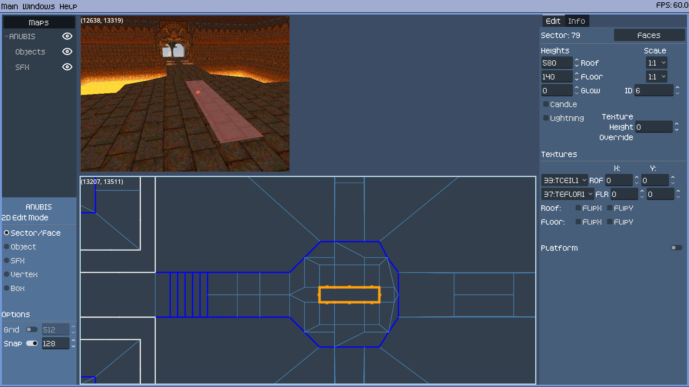

# RotH Editor
- [Introduction](#introduction)
- [Acknowledgments](#acknowledgments)
- [Getting Started](#getting-started)
- [Map Editor Features](#map-editor-features)
- [DBase Editor Features](#dbase-editor-features)
- [Tutorials](https://github.com/slidick/roth-editor/wiki)
- [Extras](#extras)
- [Compiling](#compiling)


## Introduction
RotH Editor is a software tool designed to create and edit the maps and supporting files for the 1996 DOS game Realms of the Haunting. This application is written using [Godot](https://godotengine.org) and is under active development.


### Please Read
- You must own a copy of the game to work with this software
- [Join the ROTH Discord!](https://discord.com/invite/v4YVN4e)
- Have a suggestion or feedback? Have a question or found a bug? Feel free to open an issue on the [issue tracker](https://github.com/slidick/roth-editor/issues) or leave a message on the discord


## Acknowledgments
Development of this project is built upon the work of others without which this project would not exist.
- Challex and their [beyond-the-ire](https://github.com/avchally/beyond-the-ire/) ROTH decompilation project provides the understanding of the map files
- Yagotzirck's work on [roth_ripper](https://github.com/Yagotzirck/roth_ripper/) provides support for parsing the das, icons, sfx, dbase200, and dbase300 files
- W4kfu and winterheart's contributions to [OpenROTH/tools](https://github.com/OpenROTH/tools/) provide the support for the dbase100, dbase400, dbase500, and gdv files
- And of course a special thanks to Gremlin Interactive for creating this phenomenal game!


## Getting Started

### Installation & Configuration
Download the latest [release](https://github.com/slidick/roth-editor/releases) for your platform. Extract to a location of your choosing and run the executable. Once started you must go to *Main -> Settings* and configure the installation directory of Realms of the Haunting by selecting the ROTH.RES file. The ROTH.RES file is a key file that associates the map files with their correct texture file. It can be found in your RotH installation folder under either the ROTH/ or DATA/ directories. Once selected the fields for Dosbox and Dosbox Config should be filled in automatically, but if not please select them as well. Be sure to hit Save then close the settings window.

Once configured go to *Main -> Manage Maps*. Here you can browse all the maps from the game, create a new map, rename or delete a custom map, and import or export map packs. You can open any number of maps at a time though it's not recommended to open more than a few at a time. Map names must be 8 characters or less and unique amongst all maps.


### Saving & Running
- Save maps by right-clicking the map name and selecting *Save* or *Save-As*
- Test run loaded maps by pressing R
- The map run is always the map loaded in the 2D view
- Change between the maps loaded in the 2D view by right-clicking a map name and selecting *2D Edit Mode*. Changes will not be lost
- The starting player position will match the current position of the camera in the 3D view


### Additional Editors
Also available is support for editing some of the additional game files. Go to *Main -> Manage DBase Packs* or *Main -> Manage SFX Packs* to get started. You should start by duplicating the original files and giving it a name. The pack set as *Active* will be used when testing maps with the **R** key.

The following files are currently supported:
- DBASE100.DAT
- DBASE400.DAT
- FXSCRIPT.SFX

See the [DBase Section](#dbase-editor-features) and [SFX Section](#sfx-editor-features) for more details

---

## Map Editor Features

### Overview
After opening a map, you will be greeted with the main editor window:


1) Open Maps List
  - This displays the list of currently open maps
  - Right-click a map to find:
    - Save: Save the map. Can't save over vanilla maps
    - Save-As: Save the map with a new name
    - [Edit Map Metadata](#map-metadata): Change additional map properties
    - [Edit Array02](#unknown-array02): Edit Array02's data. Its purpose is currently unknown
    - [Edit Commands](#command-editor): Loads the map's commands in the Command Editor
    - 2D Edit Mode: Loads the map in the 2D view. Freely switch between maps without losing any changes
    - Close Map: Closes the map
  - Use the eyeball icons to toggle visibility of maps, objects, and sound effects
2) Editor Options
  - View the name of the currently loaded map in the 2D view
  - Select between 5 different 2D view selection modes: Sector/Face, Object, SFX, Vertex, and Draw
  - Change or disable the size of the grid
  - Change or disable automatic snapping. Smallest allowed is 2
  - Paste Options: Change the properties applied when pasting using V in the 3D view
3) [3D View](#3d-view)
  - Explore all open maps in a beautiful 3D view
  - Click and drag on the split between the views to resize
4) [2D View](#2d-view)
  - A top down view of a single open map
5) [Inspector Panel](#inspector-panel) / [History Panel](#history-panel)
  - Inspector
      - After selecting items, view and edit their properties here
      - Search for specific ID values using the search bar
  - History
      - Undo / Redo system
      - View a history of actions performed separated by each open map
      - Revert to a previous state by selecting from the list
6) Switch between Map and Command Editors
  - [Command Editor](#command-editor)
    - Every map contains a scripting section responsible for most of the action in the map
    - From spawning enemies and opening doors to playing dialog and cutscenes and many things in between
    - The Command Editor makes it easy to chain any number of actions and logic together based on different trigger types
    - Trigger types include entering sectors, Left or Right-Clicking sectors, faces, or objects, killing enemies, and more
7) View information about the size of the current map


### 3D View
- Explore the world using keyboard and mouse
  - Hold **Right-Click** or press **F1** to toggle mouse look
  - Use **WASD** for movement and strafing
  - Use **Q** and **E** to lower and raise the camera
  - Use the **Mousewheel** to change speed
  - Hold **Shift** for a speed boost

- Select Sectors, Faces, Objects, and Sound Effects
  - Use **Left-Click** to select things
  - **Hold Shift while Left-Clicking** to select additional items of the same type
  - You can also **hold Shift and Left-Click while dragging** the mouse to select things quickly
  - **Hold Shift while Middle-Clicking** to deselect individual items
  - **Hold Shift and Middle-Click while dragging** to deselect quickly

- Copy and paste Sector and Face data
  - Press **C** while pointing at a Sector or Face to copy all its properties
  - Press **V** while pointing at another Sector or Face to change its properties to match
  - Press **Alt+V** or use the **Paste Options button** in the bottom left to change which properties get applied


### 2D View
- Get a top down view of the map
  - Hold **Middle-Click while dragging** to pan the view
  - Use the **Mouse Wheel** to zoom in and out
  - Use the panel in the bottom left to see the name of the current map, change selection modes, and change grid and snap options

- Sector / Face Mode: Select sectors or faces
  - Select sectors or faces by **Left-Clicking**
  - **Hold Shift while Left-Clicking** to select additional items of the same type
  - Use **Right-Click** to deselect
  - Hold Shift and left-click or right-click while dragging to select or deselect quickly
  - **Hold Ctrl** to enable *Sector Box Select*
    - **Left-Click and drag** to select
    - **Hold Shift** to add to selection
    - **Right-Click** to deselect
  - Select sectors and use **Ctrl+C** to copy or **Ctrl+X** to cut
  - Use **Ctrl-V** to enter paste mode
    - Move the mouse and use left-click or enter to paste
    - **Hold Ctrl** to lock the template to an axis
    - **Hold Alt** to rotate. **Hold Alt+Ctrl** to snap rotation to 15 degree increments
    - Use the **P** key to pin the template down then use the arrow keys for finer adjustment
    - Use the **0 (Zero)** key to return the template to the position it was copied at. Useful when pasting across maps to create transitions
  - Delete selected sectors with the **DEL (Delete)** key
  - Merge selected sectors with the **M** key
  - Press **Ctrl+H** to hide selected sectors
  - Press **Shift+Ctrl+H** to hide all but selected sectors
  - Press **Alt+H** to show hidden sectors
  - Press **N** to cycle between overlapping sectors

- Object Mode: Select, move, and create objects
  - Select objects by **Left-Clicking** or dragging a box around objects
  - **Hold Shift** to add to selection
  - **Shift Left-Click** on an already selected object to deselect
  - **Right-Click** a selected object to bring up the options: Copy and Delete
  - **Right-Click** a blank space to bring up the options: New Object and Paste
  - **Left-Click and drag** to move selected objects
    - **Escape** to cancel mid-move
  - Movement effected by snap value
  - **Hold Alt** while moving the mouse to rotate selected objects facing direction
  - **Hold Alt and Shift** while moving the mouse to rotate selected objects as a group
  - **Hold Ctrl** while rotating to enable snapping at 15 degree increments

- SFX Mode: Select, move, and create ambient and scripted sound effect nodes
  - Same controls as Object Mode

- Vertex Mode: Select and move vertices, split faces, merge faces, split sectors
  - Select vertices by **Left-Clicking** on individual vertices or box dragging around a group
  - **Hold Shift** to add to the current selection
  - **Left-Click and drag** to move
    - **Hold Ctrl** to lock to an axis
    - Press **Escape** to cancel mid-move
  - Movement effected by snap value
  - **Right-click while dragging** a vertex to delete it
  - Moving a vertex onto a neighboring vertex also delete it
  - Moving two opposite facing faces on top of each other will merge them
  - **Right-Click on a smaller green vertex** to split the face creating a new vertex at that point
  - **Hold Shift and Left-Click while dragging** from one vertex to another in the same sector to split a sector in two
  - Select a vertex belonging to multiple sectors and press **U** to unmerge

- Draw Mode: Draw new sectors
  - Box mode allows you to **Left-Click and drag** to create a new rectangle sector
  - Additional options to come


### Inspector Panel

#### Edit Selected Sectors' Properties



- Faces button allows you to quickly select individual faces of the sector
- Edit floor and ceiling heights
  - Use the +/- buttons to adjust all selected by the step amount
- Edit sector lighting
- Toggle lit by the lantern
- Toggle lightning effect
- Give the sector an ID number. Used by the Command Editor
- Texture Height Override changes the height of two-sided faces in the sector that have the flags Transparency and Fixed Height Transparency set
  - Positive values pin to the ceiling
  - Negative values pin to the floor
- Edit floor and ceiling textures including shifting, scaling, and flipping
- Add sector platforms
  - Every sector can have a floating platform
  - Edit platform's floor and ceiling heights
  - Edit platform's floor and ceiling textures including shifting and scaling
  - Lower the platform's floor below its ceiling to create a collision-less platform used to create cloud-like effects


#### Edit Selected Faces' Properties


- Sector button allows you to quickly select the sector to which the face belongs
- Sister button allows you to quickly select the opposite side of a double-sided face
- Edit mid, lower, and upper textures
  - For textures to repeat, their size must be a power of 2 on that axis
  - Otherwise, if a face is longer than a texture, graphical glitches will occur
  - The *SKY* texture is a special texture that is completely transparent
  - To create a room with a skybox, set the walls of the room to have the flag *EDGE MAP*
- Set the walls x-shift and y-shift values
- Set the Face ID. Used by the Command Editor
- To change the faces x-shift, y-shift, or face ID values, you must toggle the enable button. If a face doesn't require any of these things the button should remain disabled
- Edit texture flags
  - *Transparency*: Gives a double-sided face a texture
  - *X-Flip*: Flips the texture horizontally. If using a palette color this makes the color semi-transparent
  - *Image Fit*: Scales the texture to perfertly fit the wall both vertically and horizontally
  - *Fixed Size Transparency*: Makes a double-sided face with the Transparency flag set use the Fixed Height Override value from its sector's properties to be the texture's fixed height
  - *No Reflect*: Disables shadows cast on the wall by the player
  - *Half Pixel*: Scales the texture down by one half
  - *Edge Map*: Draw a skybox above the wall
  - *Draw From Bottom*: Draws the texture starting at the bottom rather than the top. Used mostly for sectors whose ceiling height will change in game and you don't want the wall to look like it's raising or lowering with it
- Horizontal Fit value is how many pixels of the texture's width to draw on the wall. The Auto button will set this to the wall's length
- Edit face flags
  - *Stop Walk*: Stops the player, enemies, and projectiles from crossing
  - *Stop Alen*: Stops enemies from crossing. If combined with Stop Walk, the player will be stopped but not projectiles
  - *Flag 3*: Nothing?
  - *RoomBlk*: Certain commands can be made to effect all connected sectors. Setting this flag on a double-sided face will stop those commands from crossing to the adjacent sector
  - *Flag 5*: Nothing?
  - *Flag 6*: Nothing?
  - *Flag 7*: Nothing?
  - *Block Under*: When used in combination with Stop Walk, only blocks the player from going under an adjacent sector's platform
- Advanced
  - Flip Face: This was added to help remedy an earlier bug but was left in to see if it had any interesting potential. Doesn't really seem to. Will probably be removed in the future
  - Change Sister: Manually change the associated opposite side of a double-sided face. This can be used to create interesting effects like one-way passages or completely changing the layout behind the player


#### Edit Selected Objects' Properties


- Edit the objects position and height
- Edit the objects render style and rotation
  - Fixed objects have a set angle while billoard style always faces the player
  - Many objects when rendered as billboards have multiple textures that change with the viewing angle, therefore still require having a rotation set
  - 3D Objects always have a fixed rotation but should be left on billboard as it affects their collision
- Change the objects brightness
- Change the objects Unk0x0C value
- Set the Objects ID value. Used by the Command Editor
- Edit Object Flags
  - *3D Object*: Signifies either a 3D modeled object like chairs and sofas, as well as multi sprite objects like bushes and chandeliers
  - *Disable Collision*: Disables an objects collision with the player
  - *Unused*: Nothing?
  - *Lower Collision*: Most objects are drawn from their position upwards, but some object's textures have a flag set to draw them from their position downwards. When that is the case this flag should be set to also have the object's collision be drawn downwards as well
  - *X-Flip*: Flip the object's texture horizontally
  - *Flag 6*: Unknown. Set on every object
  - *Unused*: Nothing?
  - *Start Hidden*: The object starts hidden. Use the command editor to spawn the object
- Select the actual object


#### Edit Selected Sound Effects' Properties


- Edit the sound effects position. They don't have a height value
- Change the sound effect. A list can be found at *Windows -> Extras -> SFX*
- Use the play button to here the selected sound.
- Set the Sound Effects ID value. Used by the Command Editor
- The five remaining fields are unknown at this time


### History Panel


The history panel contains a tab for each open map. Click down the list to revert the state of that map back to what it was right after the action listed. If a new action is performed while at a previous state, all later states will then be lost.


### Map Metadata


Right-click the map name in the map list and select *Edit Map Metadata* to edit the following:
- Player starting position & rotation. Press the *Set to Current* button to set these values to the current camera position and rotation
- Player default move speed. Default 5
- Player height. Default 72
- Max climb height. Default 32
- Minimum fit height. Default 48
- Light Ambience. Default 2
- Candle Glow. Default 8
- Candle Ambience. Default 0
- Use Candle Shade. Give the candle a purplish hue. Only noticable when using a higher candle glow. Default Off
- The texture index used for the map's skybox. Default: Depends on the DAS file being used.
- Unk0x1A. Unknown. Nothing?


### Unknown Array02


- There is sometimes an additional array of values paired with the sfx array
- It's not yet clear if they relate to the sound system as well or if they're something else entirely
- It can be edited manually by right-clicking the map name and selecting edit Array02


---

## Command Editor


- A command chain editor is available
- Check the [Beyond-the-Ire documentation](https://github.com/avchally/beyond-the-ire/tree/master/file_documentation) for current info on the known commands
- More documentation to come


---

## DBase Editor Features


- Ability to edit subtitles
- Ability to edit item, monster, and weapon data
- Ability to edit global command system
- [Check the Beyond the Ire reference](https://github.com/avchally/beyond-the-ire/blob/master/file_documentation/DBASE100_commands.md)
- More documentation to come


---

## SFX Editor Features


- Ability to edit and change sound effects
- Duplicate and edit the original sounds or create a new sfx pack from scratch
- Change names and descriptions
- Double-click an index to preview the sound
- Right-click to edit, clear, or delete
- Editor accepts 16bit wav files. Will be automatically downsampled to 22khz
- Simple features like trimming, amplitude adjustment, and reversing available
- Ability to record directly from a microphone
- Can change a sound effect to an existing sound effect
- Shuffle all sound effects for some crazy fun
- Filter by name and description

---

## Extras
The extras window gives view only access to many of the other files found in the ROTH installation.


### Commands
These are the global commands stored in the DBASE100.DAT file. They are referenced heavily from the individual maps' command system. Information for common commands will be displayed in the panel on the right. [Check the Beyond the Ire documentation here](https://github.com/avchally/beyond-the-ire/blob/master/file_documentation/DBASE100_commands.md) for a full list of these commands.

Some common commands are:
- 5: Play dialog audio. The value is the offset to the subtitle in DBASE400.DAT
- 7: Play video. The value is the 1-based index into an array in DBASE100.DAT. Corresponds to the numbers on the cutscenes tab.
- 8: Cutscene choice string. The value is the offset to the subtitle in DBASE400.DAT


### Inventory
Inventory data, monster data, and bullet data can be found on this page. 


### Cutscenes
Cutscene subtitles can be viewed easily here. Videos can be played back by double-clicking or pressing play.


### Interface
This tab shows the text used for the game's ui.


### Animations
This tab shows the weapon animations used in the game.


### Icons
This tab shows the in-game icons.


### SFX
This tab shows the sound effects used in the game. Double-click an entry to play it.


### Backdrop
This tab shows the backdrop used in the game.


### Dialog
The dialog tab allows you to browse, search, and play the in-game dialog. Double-click an entry to play it or select play-all to play everything.


### Textures
The DAS files hold most of the textures used in the game. The standard DAS files (DEMO.DAS, DEMO1.DAS, DEMO2.DAS, DEMO3.DAS, DEMO4.DAS) contain textures for floors, ceilings, walls, skyboxes, and decorative objects. These are grouped by theme and shared between the maps. A map file may have only one of these files associated with it. The ADEMO.DAS file is always loaded and contains textures for enemies, projectiles, and collectible objects. Use the textures tab to browse the contents of these files.


---

## Compiling
This repo uses submodules so be sure to clone using:
```
git clone --recursive-submodules <url>
```
or initialize submodules after cloning with:
```
git clone <url> <repo-dir>
cd <repo-dir>
git submodule update --init
```
Keep submodules up to date when pulling updates:
```
git pull
git submodule update
```

### Install Godot
Head over to [godotengine.org](https://godotengine.org) to download and install the latest version for your platform.

### Compiling the gdextension (Optional)
This program is mostly written using the Godot scripting language called gdscript. A small portion has been rewritten as a compiled c++ extension for Godot called a gdextension and can be found in the `addons/roth_gdextension` directory. Pre-compiled versions of this extension are included in this repo for windows and linux in the `addons/roth_gdextension/bin` directory. If you need to recompile for a different OS or after making changes to the code in `addons/roth_gdextension/src`, you can adapt the following:

```
cd <repo-dir>/addons/roth_gdextension
scons platform=windows target=template_debug
```

Requires the SCons build tool and a c++ compiler. Refer to the documentation on [Compiling Godot](https://docs.godotengine.org/en/stable/contributing/development/compiling/index.html) and [GDExtension](https://docs.godotengine.org/en/stable/tutorials/scripting/gdextension/gdextension_cpp_example.html) for more details and additional prerequisites.

### Launch Godot and import the project
When starting Godot you'll be greeted with the project manager. Select the *Import* button at the top, navigate to the repo directory, and select the project.godot file. Keep *Edit Now* selected and press *Import*. After a moment the project will be opened. The program can be run from the editor by pressing **F5** or clicking the *Play Button** in the top right.

### Modifying the project
Look around and make changes. At this time the source code is extremely lacking in documentation. I will improve the code comments and add a project overview here in the future. Refer to [Godot's documentation](https://docs.godotengine.org/en/stable/index.html) and other resources for information on Godot itself.

### Exporting the project
The program can be exported by going to *Project -> Export*. Select the platform you'd like to export for and click *Export Project*. You'll need to follow the instructions to install the *export templates* the first time you try exporting as well as after minor upgrades to Godot. Refer to Godot's documentation on [Exporting](https://docs.godotengine.org/en/stable/tutorials/export/exporting_projects.html) for more information.

