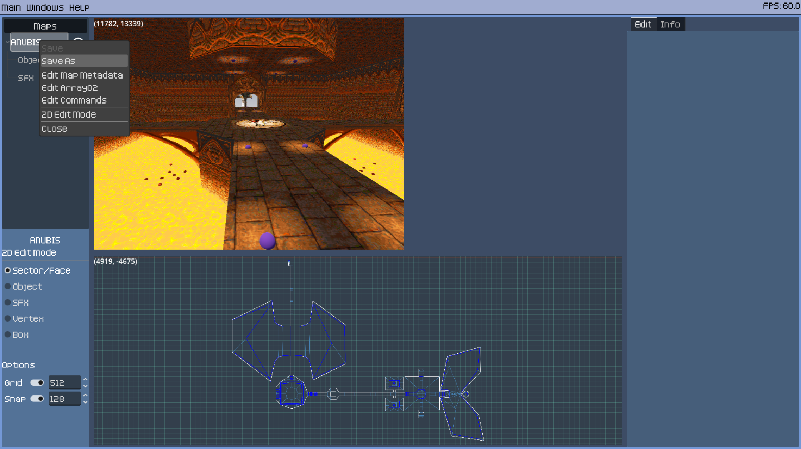
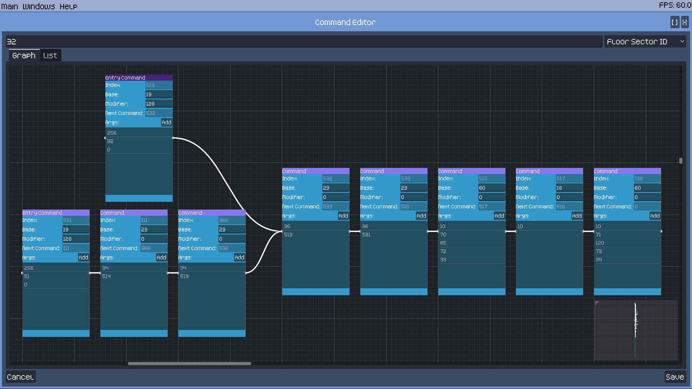

# RotH Editor
- [Introduction](#introduction)
- [Acknowledgments](#acknowledgments)
- [Getting Started](#getting-started)
- [Editor Features](#editor-features)
- [Extras](#extras)
- [Compiling](#compiling)

## Introduction
RotH Editor is a software tool designed to create and edit maps for the 1996 DOS game Realms of the Haunting. This application is written using [Godot](https://godotengine.org) and is still under heavy development.

### Please Read
- You must own a copy of the game to work with this software
- This is still alpha software and fairly unoptimized so expect it to use a chunk of ram and vram. It will contain bugs
- Aspects of the map file are still unknown
- There is no undo/redo yet
- This **can** be used to create complete maps at this time
- Have a suggestion or feedback? Have a question or found a bug? Feel free to open an issue on the [issue tracker](https://github.com/slidick/roth-editor/issues) or leave a message on the [RotH Discord #modding channel](https://discord.com/invite/v4YVN4e)


## Acknowledgments
Development of this project is built upon the work of others without which this project would not exist.
- Challex and their [beyond-the-ire](https://github.com/avchally/beyond-the-ire/) roth decompilation project provides the understanding of the map files
- Yagotzirck's work on [roth_ripper](https://github.com/Yagotzirck/roth_ripper/) provides support for parsing the das, icons, sfx, dbase200, and dbase300 files
- W4kfu and winterheart's contributions to [OpenROTH/tools](https://github.com/OpenROTH/tools/) provide the support for the dbase100, dbase400, dbase500, and gdv files
- And of course a special thanks to Gremlin Interactive for creating this phenomenal game!

## Getting Started
Download the latest [release](https://github.com/slidick/roth-editor/releases) for your platform. Extract to a location of your choosing and run the executable. Once started you must go to Main -> Settings and configure the installation directory of Realms of the Haunting by selecting the ROTH.RES file. The ROTH.RES file is a key file that associates the map files with their correct texture file. It can be found in your RotH installation folder under either the ROTH/ or DATA/ directories. Once selected the fields for Dosbox and Dosbox Config should be filled in automatically, but if not please select them as well. Be sure to hit Save then close the settings window.

Once configured you can go to Main -> Open Map to browse all the maps from the game. You can open anywhere from one to all of the maps at a time though it's not recommended to open more than a few at a time. You may also start a new map from Main -> New Map. Give it a name and select a texture file to use. Map names must be 8 characters or less and unique amongst all maps.


## Editor Features

### Saving & Running
- Save maps by right-clicking the map name and selecting 'Save' or 'Save-As'
- Test run a single map with no ademo.das (enemies, objects) file by pressing 'r'
- Test run a map with transitions available and the ademo.das file by pressing 't'
- The map run is always the map loaded in the 2d edit view
- Change between the maps loaded in the 2d view by right-clicking a map name and selecting '2D Edit Mode'. Changes will not be lost
- The starting player position will match the current position of the camera in the 3d view



### Sectors
- Edit floor and ceiling textures including scaling, flipping, and shifting
- Copy and paste sector textures in 3d view
  - Press 'c' while pointed at a floor or ceiling to copy both and press 'v' to paste to another
- Edit floor and ceiling heights
- Edit sector lighting
- Edit sector flags (candle, lightning)
- Edit sector id
- Add sector platforms
  - Every sector can have a floating platform
  - Lower the platforms floor below the ceiling to create a collision-less platform used to create cloud-like effects
- Sectors should be convex otherwise graphical glitches may occur
- Delete a sector by selecting it and pressing 'del'


### Faces
- Edit mid, lower, and upper textures
  - For textures to repeat, their size must be a power of 2 on that axis
  - Otherwise, if a face is longer than a texture, graphical glitches will occur
  - The *SKY* texture is a special texture that is completely transparent
  - To create a room with a skybox, set the walls of the room to have the flag *EDGE MAP*
- Copy and paste face textures in 3d view
  - Press 'c' while pointed at a face to copy and 'v' at another face to paste
- Edit texture flags
- Edit face flags
- Edit face id
- Delete a double-sided face by selecting it and press 'del' remerging the two sectors
  - The sector from which you delete the face will replace the opposite sector


### Vertices
- Draw new rectangular sectors
  - Select 'box mode' and click and drag to form new sectors
- Split existing faces
  - Right click on the small green square between vertices to split a face
- Split sectors
  - Hold shift and left-click drag from one vertex to another in the same sector to split a sector in two
- Move vertices
  - Select a single or multiple vertices and drag around to move
- Delete vertices
  - Right-click while dragging to delete a vertex
- Delete face
  - Drag a vertex onto its neighboring vertex to delete the face inbetween
- Merge vertices to create double-sided faces
  - Drag different sector's neighboring vertices on top of each other to create double-sided faces
  - Creating a new sector with a face directly overlapping an existing face will also create a double-sided face
  - Dragging a single vertex onto another won't merge them, until exiting vertex mode
- Unmerge vertices
  - Select a vertex belonging to multiple sectors and press 'U' to unmerge
  - Reselecting and not moving will remerge a double-sided face
  - Exiting vertex mode while still overlapped will remerge vertices


### Objects
- Edit position
  - Click and drag in 2d view to move objects around
- Edit rotation
- Edit texture
- Edit brightness
- Set fixed direction or billboard style rendering
- Edit Object ID
- The two remaining fields can be edited, but their purpose is still being researched
- Right-click -> New to create a new object
- Right-click -> Copy to copy an object
- Right-click -> Paste to paste an object


### Sound Effects
- Edit position
  - Click and drag in 2d view to move sfx around
- Edit sound effect index
- The remaining 6 fields can be edited, but their purpose is still being researched
- Right-click -> New to create a new sfx
- Right-click -> Copy to copy a sfx
- Right-click -> Paste to paste a sfx


### Map Metadata
- Access map metadata by right-clicking the map name and selecting 'Edit Map Metadata'
- Edit starting position & rotation
- Edit move speed
- Edit player height
- Edit max climb height
- Edit minimum hit height
- Edit candle glow
- Edit light ambience
- Edit texture used for skybox
- The three remaining fields can be edited, but their purpose is still being researched


### Unknown Array02
- There is sometimes an additional array of values paired with the sfx array
- It's not yet clear if they relate to the sound system as well or if they're something else entirely
- It can be edited manually by right-clicking the map name and selecting edit Array02


### Command/Scripting System
- A basic command chain viewer and editor is available
- What each command type is and what additional parameters they take is still being researched
- Once specific commands are figured out, they will receive custom editing support
- Check the [beyond-the-ire documentation](https://github.com/avchally/beyond-the-ire/tree/master/file_documentation) for current info on the known commands



## Search
Since our current understanding of the .RAW files (map files) used in Realms of the Haunting is still incomplete, the search window can be helpful in finding possible values or shared values for some of the unknown fields in order to determine what they represent.


## Extras
The extras window gives view only (for now) access to many of the other files found in the roth installation.

### Commands
These are the global commands stored in the DBASE100.DAT file. They are referenced heavily from the individual maps' command system. If a command type is known, information about what it's referencing will be displayed in the panel on the right. 

Some of the known commands are:
- 5: Play dialog audio. The value is the offset to the subtitle in DBASE400.DAT
- 7: Play video. The value is the 1-based index into an array in DBASE100.DAT. Corresponds to the numbers on the cutscenes tab.
- 8: Cutscene choice string. The value is the offset to the subtitle in DBASE400.DAT


### Inventory
Inventory data, monster data, and bullet data can be found on this page. 


### Cutscenes
Cutscene subtitles can be viewed easily here. Videos can be played back by double-clicking or pressing play.


### Interface
This tab shows the text used for the game's ui.


### Animations
This tab shows the weapon animations used in the game.


### Icons
This tab shows the in-game icons.


### SFX
This tab shows the sound effects used in the game. Double-click an entry to play it.


### Backdrop
This tab shows the backdrop used in the game.


### Dialog
The dialog tab allows you to browse, search, and play the in-game dialog. Double-click an entry to play it or select play-all to play everything.


### Textures
The DAS files hold most of the textures used in the game. The standard DAS files (DEMO.DAS, DEMO1.DAS, DEMO2.DAS, DEMO3.DAS, DEMO4.DAS) contain textures for floors, ceilings, walls, skyboxes, and decorative objects. These are grouped by theme and shared between the maps. A map file may have only one of these files associated with it. The ADEMO.DAS file is always loaded and contains textures for enemies, projectiles, and collectible objects. Use the textures tab to browse the contents of these files.


## Compiling
This repo uses submodules so be sure to clone using:
```
git clone --recursive-submodules <url>
```
or initialize submodules after cloning with:
```
git clone <url> <repo-dir>
cd <repo-dir>
git submodule update --init
```
Keep submodules up to date when pulling updates:
```
git pull
git submodule update
```

### Install Godot
Head over to [godotengine.org](https://godotengine.org) to download and install the latest version for your platform.

### Compiling the gdextension (Optional)
This program is mostly written using the Godot scripting language called gdscript. A small portion has been rewritten as a compiled c++ extension for Godot called a gdextension and can be found in the `addons/roth_gdextension` directory. Pre-compiled versions of this extension are included in this repo for windows and linux in the `addons/roth_gdextension/bin` directory. If you need to recompile for a different OS or after making changes to the code in `addons/roth_gdextension/src`, you can adapt the following:

```
cd <repo-dir>/addons/roth_gdextension
scons platform=windows target=template_debug
```

Requires the SCons build tool and a c++ compiler. Refer to the documentation on [Compiling Godot](https://docs.godotengine.org/en/stable/contributing/development/compiling/index.html) and [GDExtension](https://docs.godotengine.org/en/stable/tutorials/scripting/gdextension/gdextension_cpp_example.html) for more details and additional prerequisites.

### Launch Godot and import the project
When starting Godot you'll be greeted with the project manager. Select the 'Import' button at the top, navigate to the repo directory, and select the project.godot file. Keep 'Edit Now' selected and press 'Import'. After a moment the project will be opened. The program can be run from the editor by pressing 'F5' or clicking the play button in the top right.

### Modifying the project
Look around and make changes. At this time the source code is extremely lacking in documentation. I will improve the code comments and add a project overview here in the future. Refer to [Godot's documentation](https://docs.godotengine.org/en/stable/index.html) and other resources for information on Godot itself.

### Exporting the project
The program can be exported by going to 'Project -> Export'. Select the platform you'd like to export for and click 'Export Project'. You'll need to follow the instructions to install the *export templates* the first time you try exporting as well as after minor upgrades to Godot. Refer to Godot's documentation on [Exporting](https://docs.godotengine.org/en/stable/tutorials/export/exporting_projects.html) for more information.
